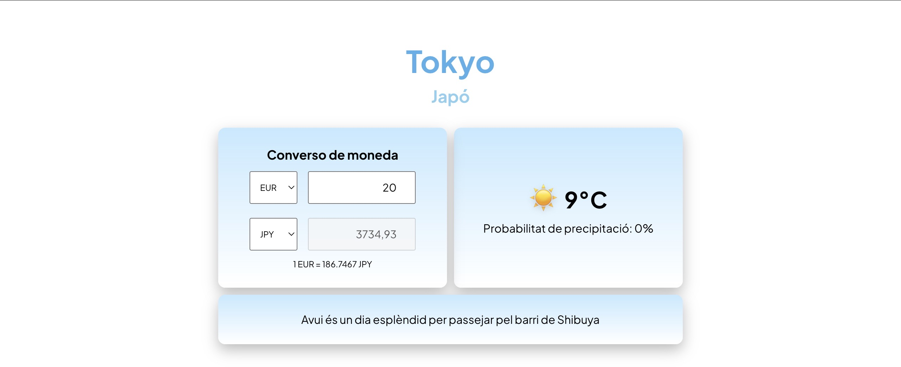
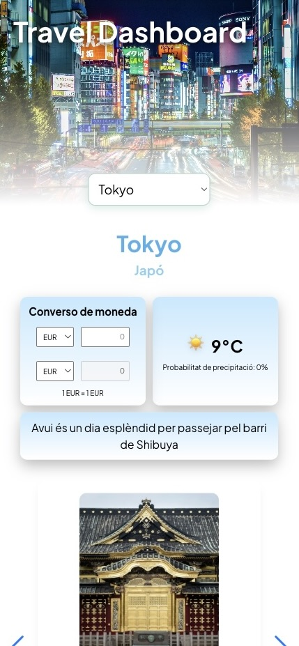
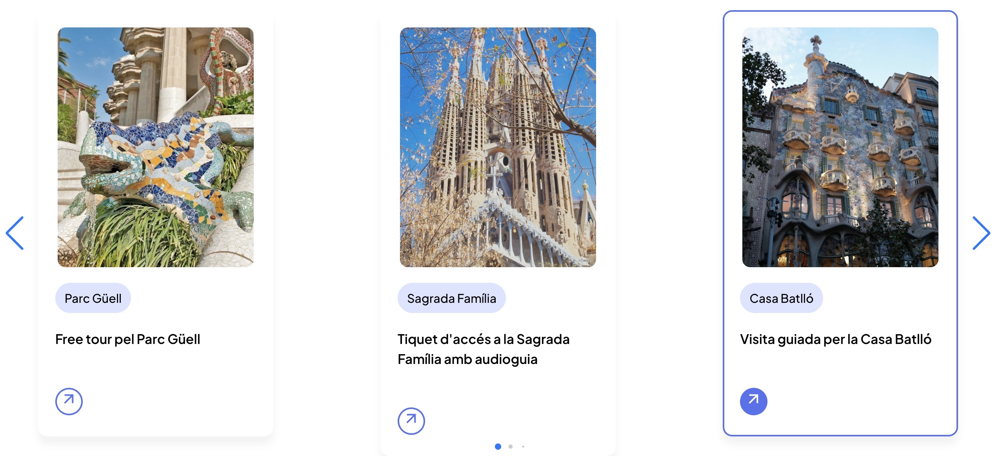

[](https://classroom.github.com/a/n3t5IY6n)

# Travel Dashboard

L'activitat consistia a crear un Travel Dashboard amb HTML, CSS i JavaScript vanilla per consultar informació d'una ciutat abans de viatjar. La pàgina havia de mostrar el temps actual, la probabilitat de pluja, la moneda local i la conversió des d'euros, carregant dades amb `fetch` des d'APIs externes. També s'havia d'implementar un selector de ciutat i generar un petit missatge de recomanació segons les dades obtingudes. El projecte havia de ser responsive (Mobile First) i complir els requisits tècnics i d'organització del codi

## Demo en línia
🔗 [Veure projecte](https://0373-dam-pr2-annaegea07.vercel.app/)

> [!NOTE]
> Aquest projecte és responsive i segueix la metodologia Mobile First

## Estructura de carpetes

```text
0373-dam-pr2-annaegea07/
├── index.html
├── main.js
├── slider.js
├── README.md
├── css/
│   ├── style.css
│   ├── reset.css
│   └── slider.css
└── img/
    ├── big-ben-tower.jpeg
    ├── Casa_Milà_general_view.jpg
    ├── Estatua-de-la-Libertad.jpeg
    ├── img-Torre-Eiffel.jpeg
    ├── img-sagradafamilia.jpeg
    ├── img-Times-Square.jpeg
    ├── img-Central-Park.jpeg
    ├── img-Shinjuku.jpeg
    ├── img-Templo-Pura-Besakih.jpeg
    ├── fletxaDreta.png
    └── fletxaEsquerra.png
```

💡 Dins la carpeta `img/` hi ha més de 40 imatges de monuments i llocs turístics, totes renombrades amb un estil coherent i professional.

## Captures de pantalla


<br><br>

<br><br>

<br><br>


## Decisions tècniques

- **APIs externes:** S'han utilitzat APIs per obtenir dades meteorològiques i de canvi de moneda en temps real mitjançant `fetch`.
- **Mobile First:** El disseny s'ha estructurat primer per a mòbil i després s'ha adaptat per a pantalles més grans amb media queries.
- **Modularitat del JS:** El codi JavaScript s'ha separat en dos fitxers (`main.js` i `slider.js`) per mantenir el codi organitzat i llegible.

## Decisions de disseny
Com que el dashboard deixava força espai buit, vaig decidir afegir un **slider d'imatges** per donar més dinamisme visual a la pàgina. La majoria d'imatges fan referència directa als llocs que es mencionen als textos i, a més, cada títol inclou un enllaç directe al seu lloc oficial de turisme

## 🎥 Tutorial utilitzat per crear el Slider

Per implementar el slider, vaig seguir aquest vídeo, que explica pas a pas com estructurar-lo i estilitzar-lo:

[](https://youtu.be/VUtJ7FWCfZA)

## 🎥 Tutorial utilitzat per crear el conversor de moneda

Per implementar el conversor de moneda, vaig seguir aquest vídeo:

[](https://youtu.be/3BSA4zxbov8)

## 📸 Fonts de les imatges

Les imatges utilitzades provenen de [Unsplash](https://unsplash.com/es), que ofereix fotografies lliures d'ús, perfectes per a projectes educatius i prototips

## Tecnologies utilitzades


